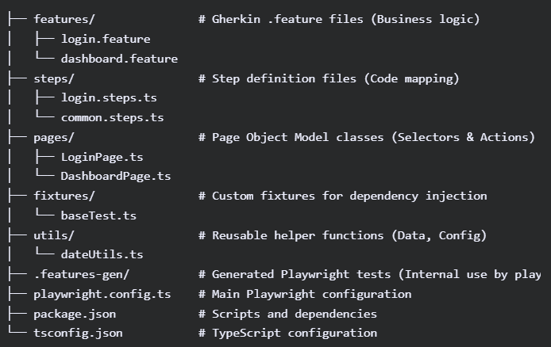

# Exercice for NUAAV

This is the exercise to show the knowledge about playwright, using the sausage demo web page.

### Folder structure



# Installation

```bash
#Install dependencies
npm install .
#Install playwright
npx playwright install
#generate the tests based on the feature files
npx bddgen
```

# Running the tests

### Running all the suite

```bash
npx playwright test
```

### Running the tests on a specific browser (by default they are executed in parallel)

```bash
npx playwright test --project chromium
```

### Filtering by tags

```bash
npx playwright test -g @smoke --project chromium
```

### Different browsers

```bash
npx playwright test --project webkit -g @smoke
```

### Number of workers

```bash
npx playwright test --workers=2
```

## Report

```bash
#Generate report
allure generate
#Serve the report
allure serve allure-results
```
